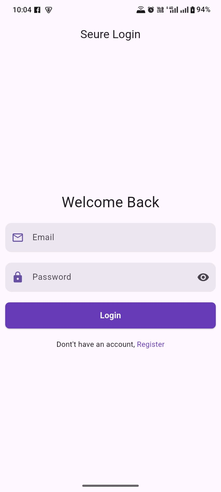
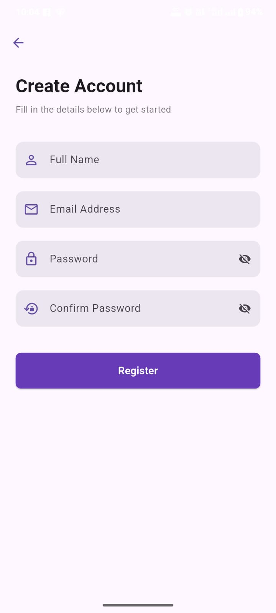
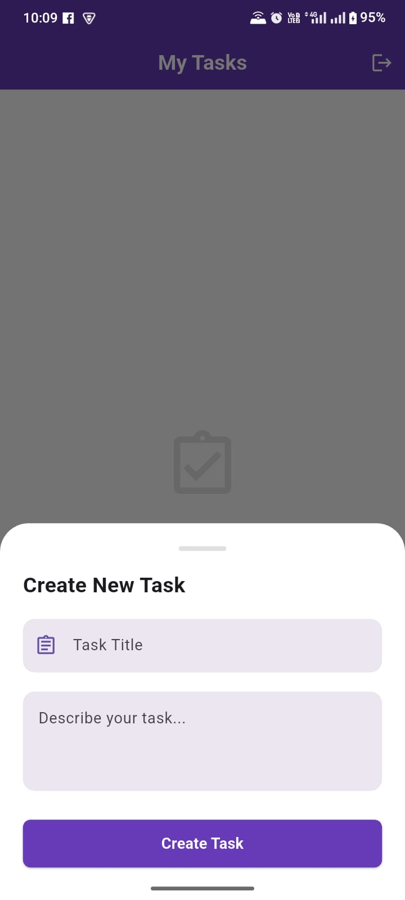

# FireTask

A new Flutter project.

## Getting Started

This project is a starting point for a Flutter application.

A few resources to get you started if this is your first Flutter project:

- [Lab: Write your first Flutter app](https://docs.flutter.dev/get-started/codelab)
- [Cookbook: Useful Flutter samples](https://docs.flutter.dev/cookbook)

For help getting started with Flutter development, view the
[online documentation](https://docs.flutter.dev/), which offers tutorials,
samples, guidance on mobile development, and a full API reference.

# Firebase Task Manager

A full-featured **Flutter** task management app powered by **Firebase**, demonstrating real-world patterns including authentication, Firestore CRUD, reactive state management with Riverpod, and declarative navigation with GoRouter.

---

## Screenshots


| Login Screen | Register Screen | Add Task |
| :---: | :---: | :---: |
|  |  |  |


---

## Features

- **Email/Password Authentication** — Register, login, and logout securely via Firebase Auth
- **Task Management** — Create, read, update, and delete tasks in real time
- **Task Completion Toggle** — Mark tasks as done with an animated checkbox
- **Task Detail View** — View full task info including creation timestamp
- **Auth Guard Routing** — Unauthenticated users are automatically redirected to login
- **Clean UI** — Polished Material Design with a deep purple theme
- **User Feedback** — Snackbars for success/error states throughout the app
- **Real-time Updates** — Firestore streams keep the UI always in sync

---

## Architecture & Tech Stack

| Layer | Technology |
|---|---|
| Framework | Flutter |
| State Management | Riverpod (`NotifierProvider`, `StreamProvider`) |
| Backend | Firebase (Auth + Firestore) |
| Navigation | GoRouter |
| Splash Screen | flutter_native_splash |

### Project Structure

```
lib/
├── common/                    # Reusable UI widgets
│   ├── app_bottom_sheet.dart  # Add/Edit task modal
│   ├── app_button.dart        # Custom loading-aware button
│   ├── app_dailog.dart        # Confirmation dialog
│   ├── app_input_decoration.dart
│   └── app_snackbars.dart
├── modules/
│   ├── auth/
│   │   ├── model/auth_state.dart
│   │   ├── providers/auth_provider.dart
│   │   └── views/
│   │       ├── login_screen.dart
│   │       └── register_screen.dart
│   └── home/
│       ├── providers/firestore_functions.dart
│       ├── home_screen.dart
│       └── task_detail_screen.dart
├── routes/
│   ├── app_routers.dart       # Route name constants
│   └── app_routes.dart        # GoRouter config with auth redirect
├── firebase_options.dart
└── main.dart
```

---

## Getting Started

### Prerequisites

- [Flutter SDK](https://flutter.dev/docs/get-started/install) ≥ 3.0
- A [Firebase project](https://console.firebase.google.com/) with **Authentication** and **Firestore** enabled
- [FlutterFire CLI](https://firebase.flutter.dev/docs/cli/) (recommended for setup)

### 1. Clone the repository

```bash
git clone https://github.com/maazkhan-tech/learning_firebase_demo.git
cd learning_firebase_demo
```

### 2. Install dependencies

```bash
flutter pub get
```

### 3. Connect Firebase

```bash
flutterfire configure
```

This generates `lib/firebase_options.dart` automatically. If you already have the file, skip this step.

### 4. Enable Firebase services

In the Firebase Console:
- **Authentication** → Sign-in method → Enable **Email/Password**
- **Firestore Database** → Create database in **production mode**

### 5. Add Firestore Security Rules

```
rules_version = '2';
service cloud.firestore {
  match /databases/{database}/documents {
    match /users/{userId} {
      allow read, write: if request.auth != null && request.auth.uid == userId;
    }
    match /tasks/{taskId} {
      allow read, write: if request.auth != null && request.auth.uid == resource.data.userId;
      allow create: if request.auth != null;
    }
  }
}
```

### 6. Run the app

```bash
flutter run
```

---

## Authentication Flow

```
App Launch
    │
    ▼
Firebase Auth Stream
    │
    ├── Not logged in ──► /login  ──► /register (optional)
    │                         │
    │                         ▼
    └── Logged in ──────► / (Home)
                               │
                               └── Logout ──► /login
```

---

## Firestore Data Model

### `users` collection

```
users/{uid}
  ├── username     : String
  ├── userId       : String
  ├── email        : String
  └── createdAt    : Timestamp
```

### `tasks` collection

```
tasks/{taskId}
  ├── title        : String
  ├── description  : String
  ├── userId       : String   ← owner's UID
  ├── isCompleted  : Boolean
  ├── createdAt    : Timestamp
  └── updatedAt    : Timestamp  (set on edit)
```

---

## Future Enhancements

- [ ] Add due dates and priority levels to tasks
- [ ] Push notifications for task reminders
- [ ] Dark mode support
- [ ] Task categories / labels
- [ ] Search and filter tasks
- [ ] Offline support via Firestore persistence

---

## Contributing

Pull requests are welcome. For major changes, please open an issue first to discuss what you would like to change.

---

## License

This project is open source and available under the [MIT License](LICENSE).

---

## Contact & Links

- **Portfolio:** [@maazkhan-tech](https://github.com/maazkhan-tech/)
- **LinkedIn:** [://linkedin.com](https://www.linkedin.com/in/maazkhan-tech/)
- **Email:** [maazkhan.expert@gmail.com](mailto:maaz@example.com)

---
[Back to Top](#FireTask)
